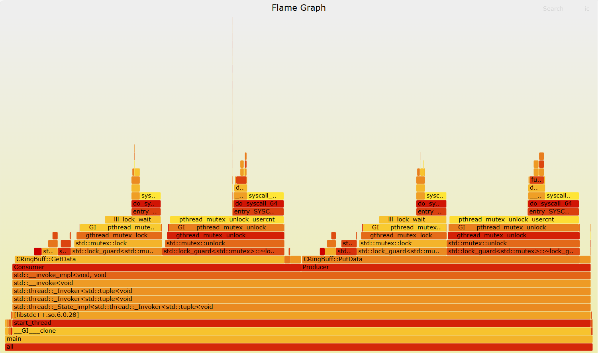
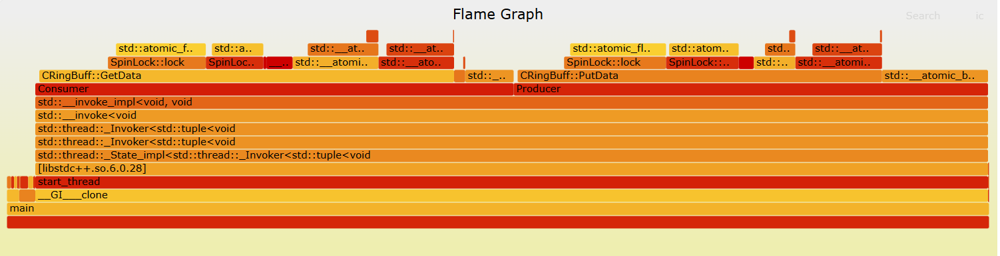
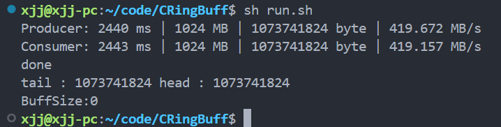
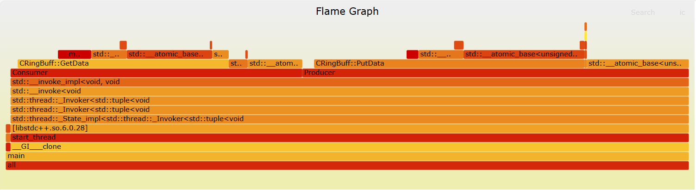

<!--
 * @Description: Copyright Xiao
 * @Autor: Xjj
-->

### 测试环境
ubuntu20系统的虚拟机，内存5.7G, 4核心, 频率2.3Ghz
### 当前的性能
单生产者单消费者条件下, 缓冲区大小为1024字节，单次写入和读出均为64字节累积写入读出1024 * 1024 * 16次。经测试可达到642.00MB/s的速度写入，841.41MB/s的速度消费。

### 优化记录
| 序号 | 优化措施 | 描述 | 写入速度 | 读出速度 | 主要瓶颈 | 多线程读、写安全 |
| ---- | -------- | ---- | -------- |-------- |-------- |-------- |
| 1    | 初始方法  | 使用互斥锁保护出入队过程 | 385.39MB/s    | 474.95MB/s     | 如火焰图1所示互斥锁是其主要瓶颈问题| 支持|
| 2    | 换用自旋锁| 使用自旋锁替代互斥锁并缩小锁范围     | 397.51MB/s    | 484.61MB/s     | 如火焰图2仍锁是其主要瓶颈,从速度上看优化效果不够明显                      | 支持|
| 3    | 使用原子操作去除锁| 使用原子操作优化掉锁     | 642.00MB/s    | 841.41MB/s     | 如火焰图3原子操作的更新占比下降,从速度上看优化效果明显                      | 不支持|

### 对应火焰图

`图 1 互斥锁保护火焰图`

`图 2 自旋锁保护火焰图

`图 3 原子操作保护火焰图`