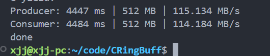

<!--
 * @Description: Copyright Xiao
 * @Autor: Xjj
-->

### 测试环境
ubuntu20系统的虚拟机，内存5.7G, 4核心, 频率2.3Ghz
### 当前的性能
单生产者单消费者条件下, 缓冲区大小为1024字节，单次写入和读出均为64字节累积写入读出1024 * 1024 * 16次。经测试可达到385.39MB/s的速度写入，474.95MB/s的速度消费。

### 优化记录
| 序号 | 优化措施 | 描述 | 写入速度 | 读出速度 | 主要瓶颈
| ---- | -------- | ---- | -------- |-------- |-------- |
| 1    | 初始方法  | 使用互斥锁保护出入队过程 | 385.39MB/s    | 474.95MB/s     | 如火焰图所示互斥锁是其主要瓶颈问题|
| 2    | 换用自旋锁| 使用自旋锁替代互斥锁     | ---           | ---            | 速度未变快                      |